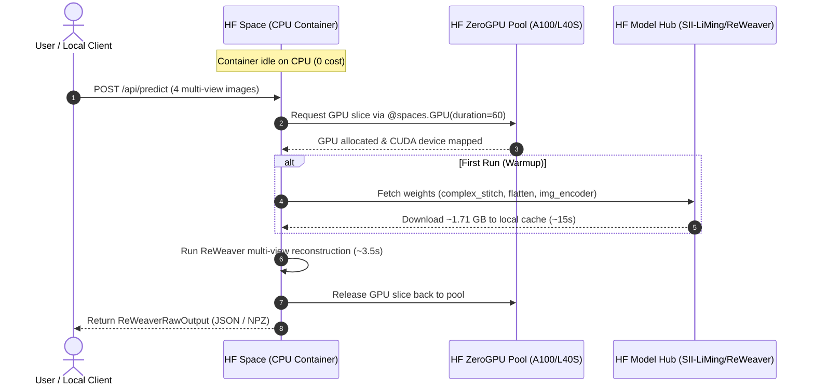

# Hugging Face ZeroGPU Compatibility & Architecture Plan

**Target Infrastructure**: Hugging Face Spaces (ZeroGPU Free Tier)  
**Space SDK**: Gradio 4+ / 5+  
**Target Architecture**: PyTorch 2.4+ / CUDA 12.x on Nvidia A100 / L40S  
**Economics**: 100% Free for single-user workflow  

---

## 1. ZeroGPU Architecture Overview

Hugging Face **ZeroGPU** provides dynamically scheduled GPU acceleration for public Spaces on the free tier. Unlike persistent dedicated GPU instances ($0.60–$4.00/hr), ZeroGPU shares high-end data center hardware (Nvidia A100-SXM4-80GB or L40S-48GB) by attaching a GPU slice only while an active inference call executes.



---

## 2. Technical Dependency Matrix

A frequent point of failure in ZeroGPU deployments is native compilation of C++/CUDA extensions during container boot (which frequently breaks due to driver/toolkit version mismatches). 

Our audit confirms ReWeaver is completely free of native compilation bottlenecks:

| Package | Upstream Spec | ZeroGPU Recommendation | Verified Status |
| :--- | :--- | :--- | :--- |
| **`torch`** | `2.6.0+cu124` | `torch>=2.4.0` | **Standard binary wheel** (pre-installed in ZeroGPU container) |
| **`torchvision`** | `0.21.0+cu124` | `torchvision>=0.19.0` | **Standard binary wheel** |
| **`pytorch3d`** | `facebookresearch/pytorch3d@stable` | **DO NOT INSTALL** | **VERIFIED FROM CODE**: Only appeared in a commented-out import (`models/matcher_curve.py:9`). Unused in real execution. |
| **`torch-scatter`** | Not listed | **DO NOT INSTALL** | Not used anywhere in the codebase. |
| **`nvdiffrast`** | Not listed | **DO NOT INSTALL** | Not used anywhere in the codebase. |
| **`spaces`** | N/A | `spaces>=0.30.0` | Required for ZeroGPU `@spaces.GPU` decorator. |
| **`gradio`** | N/A | `gradio>=4.40.0` | Provides UI and zero-config HTTP/WebSocket API. |
| **`omegaconf`** | `2.3.0` | `omegaconf>=2.3.0` | Pure Python configuration parser. |
| **`tyro`** | `0.8.0` | `tyro>=0.8.0` | Pure Python CLI/dataclass utility. |
| **`scipy`** | `1.13.0` | `scipy>=1.11.0` | Scientific computing (Hungarian algorithm/linear sum assignment). |
| **`trimesh`** | `4.4.0` | `trimesh>=4.0.0` | Pure Python mesh structures and export. |
| **`opencv-python`**| `opencv-python` | `opencv-python-headless` | Image operations without X11/GUI dependencies. |
| **`pillow`** | `10.3.0` | `pillow>=10.0.0` | Standard image loading. |
| **`huggingface_hub`**| N/A | `huggingface_hub>=0.24.0` | Efficient cached weight downloading. |

> [!TIP]
> Because ReWeaver uses **zero custom CUDA kernels**, Space cold starts complete in under 20 seconds. No GCC/NVCC compilation is triggered.

---

## 3. Resource Consumption & Quota Economics

ZeroGPU operates on a dynamic token-bucket quota per user / IP address:

* **GPU Allocation Size**: 24 GB to 48 GB VRAM.
* **Model VRAM Requirements**:
  * ViT-S Aggregator + Bipath Transformer + Flatten Decoder: **~3.8 GB VRAM** in FP32, **~2.1 GB VRAM** in BF16/FP16.
  * Headroom: > 20 GB free VRAM (virtually zero risk of Out-Of-Memory errors).
* **Execution Duration**:
  * Feed-forward inference: **2.5 – 4.5 seconds** per garment.
  * Postprocessing (curve ordering, seam bipartite assignment): **0.4 seconds**.
  * Total GPU burst: **< 5 seconds**.
* **Quota Economics for a Single Primary User**:
  * Free tier grants roughly 60–120 seconds of continuous GPU time per rolling window.
  * At ~5 seconds per reconstruction, a single user can perform **12 to 24 full garment reconstructions** consecutively before experiencing rate limiting.
  * The quota regenerates continuously over several hours.

---

## 4. ZeroGPU Lifecycle Implementation (`app.py`)

To optimize cold-start performance and GPU allocation timing, model loading and inference are decoupled:

```python
import os
import spaces
import torch
import gradio as gr
from services.reconstruction.reweaver.pipeline import ReWeaverInferencePipeline

# 1. Pipeline instance initialized on CPU during container boot
# Model weights are loaded to CPU/RAM once and stay memory-resident
pipeline = ReWeaverInferencePipeline.from_pretrained(
    repo_id="SII-LiMing/ReWeaver",
    variant="GCD_ori", # or "tileable"
    device="cpu"
)

# 2. Inference function decorated with @spaces.GPU
# GPU is allocated exclusively during this function execution
@spaces.GPU(duration=60)
def predict_garment(front_img, right_img, back_img, left_img):
    # Pipeline dynamically transfers tensors to CUDA
    output = pipeline.reconstruct(
        images=[front_img, right_img, back_img, left_img],
        device="cuda" if torch.cuda.is_available() else "cpu"
    )
    # Output is detached to CPU and serialized to JSON / NPZ
    return output.to_json(), output.to_npz_bytes()
```

---

## 5. Client Integration Strategy

The client (`apps/web` or Node CLI) connects to the Hugging Face Space using the official `@gradio/client` npm package or standard REST HTTP requests:

```typescript
import { Client } from "@gradio/client";

export async function runZeroGPUReconstruction(views: Blob[]) {
  const client = await Client.connect("qeinstein/reweaver-zero");
  const result = await client.predict("/predict_garment", {
    front_img: views[0],
    right_img: views[1],
    back_img: views[2],
    left_img: views[3],
  });

  const rawJson = result.data[0];
  return JSON.parse(rawJson);
}
```

### Fallback Strategies
1. **Queue Wait**: Gradio client handles Space cold starts and temporary GPU queue waits transparently via WebSockets.
2. **Quota Handling**: If the user exceeds their daily ZeroGPU burst, the API returns a structured `QuotaExceededError` with estimated backoff time rather than hanging.
3. **Local GPU / CPU Mode**: The portable runtime package `services/reconstruction/reweaver/` can execute locally on any CUDA GPU or CPU if offline operation is desired.
