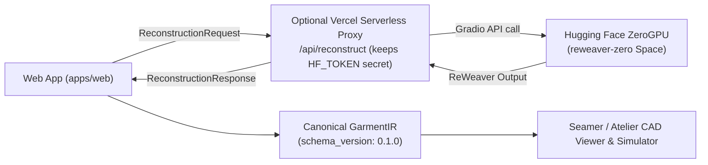

# Reconstruction API Contract Specification

**Status**: Stable (v1.0.0)  
**Layer**: Boundary between Web Application, Serverless Proxy, and ML Backends (Hugging Face ZeroGPU)  
**Intermediate Representation**: `GarmentIR` (`schema_version: 0.1.0`)

---

## 1. Architectural Role

The Reconstruction API decouples user-facing web applications from opaque, machine-learning-specific runtime details (such as Gradio WebSocket protocols, PyTorch tensor formats, or model query tokens).



---

## 2. API Contract Specification

### 2.1 Request Schema (`ReconstructionRequest`)

```typescript
export interface ViewImagePayload {
  label: 'front' | 'right' | 'back' | 'left';
  /** Either a Data URL (data:image/png;base64,...), HTTP/HTTPS URL, or raw Blob/File in multipart form */
  imageData: string | Blob;
}

export interface ReconstructionRequest {
  requestId?: string;
  /** Exactly 4 ordered viewpoint images */
  views: [ViewImagePayload, ViewImagePayload, ViewImagePayload, ViewImagePayload];
  options?: {
    /** Model checkpoint variant (default 'GCD_ori') */
    variant?: 'GCD_ori' | 'tileable';
    /** Human-readable garment title */
    garmentName?: string;
    /** Category hint (e.g. 'skirt', 'dress', 'shirt') */
    category?: string;
    /** Default fabric mass density in g/m2 (default 220) */
    defaultMaterialGsm?: number;
  };
}
```

### 2.2 Response Schema (`ReconstructionResponse`)

```typescript
export interface ReconstructionTimings {
  queueSeconds?: number;
  inferenceSeconds?: number;
  totalSeconds: number;
}

export interface ReconstructionError {
  code:
    | 'SPACE_UNAVAILABLE'
    | 'QUOTA_EXCEEDED'
    | 'TIMEOUT'
    | 'INVALID_INPUT'
    | 'INVALID_GARMENT_IR'
    | 'INFERENCE_FAILED';
  message: string;
  details?: Record<string, unknown>;
  retryAfterSeconds?: number;
}

export interface ReconstructionResponse {
  status: 'success' | 'failed';
  requestId?: string;
  /** Canonical GarmentIR document (present when status === 'success') */
  garmentIR: GarmentIR | null;
  modelVersion: string;
  timings: ReconstructionTimings;
  warnings?: string[];
  error?: ReconstructionError;
}
```

---

## 3. Standard Error Codes & User Messages

| Error Code | HTTP Status | Cause | User-Facing Explanation |
| :--- | :--- | :--- | :--- |
| `QUOTA_EXCEEDED` | 429 | ZeroGPU burst duration exceeded for the user/IP | "ZeroGPU burst quota exhausted. Please wait a few minutes before trying your next reconstruction." |
| `SPACE_UNAVAILABLE` | 503 | Hugging Face Space is paused, sleeping, or restarting | "The reconstruction service is waking up. Please retry in 30 seconds." |
| `TIMEOUT` | 504 | Inference exceeded maximum allowable duration (> 60s) | "Reconstruction timed out. Ensure images are not excessively large." |
| `INVALID_INPUT` | 400 | Fewer than 4 views provided, or corrupted image data | "Exactly 4 reference images (front, right, back, left) are required." |
| `INVALID_GARMENT_IR`| 502 | Model produced degenerate geometry that failed topology validation | "The reconstructed garment contains topological gaps. Please provide clearer photos." |
| `INFERENCE_FAILED` | 500 | Unhandled exception inside model forward pass | "Reconstruction failed. Please check runtime logs." |

---

## 4. Endpoints & Transport Modes

### Mode A: Server-Side Proxy (`/api/reconstruct`) — Recommended for Private Spaces
* **Route**: `POST /api/reconstruct` (hosted in Vercel Serverless Function).
* **Security**: Reads `HF_TOKEN` from server environment variables. Token is **never** sent to the client browser.
* **Payload**: Accepts multipart form data or JSON with base64 images.
* **Response**: Returns `ReconstructionResponse` JSON.

### Mode B: Direct Client-to-Space — Recommended for Public Spaces
* **Route**: Client calls `@gradio/client` connecting directly to `https://huggingface.co/spaces/<user>/reweaver-zero`.
* **Security**: No token required because the Space is public.
* **Endpoint**: `/reconstruct`.
* **Payload**: 4 image objects + variant string.
* **Response**: Tuple of `[garment_ir_json, npz_url, plot_url]`, parsed directly into `ReconstructionResponse`.
