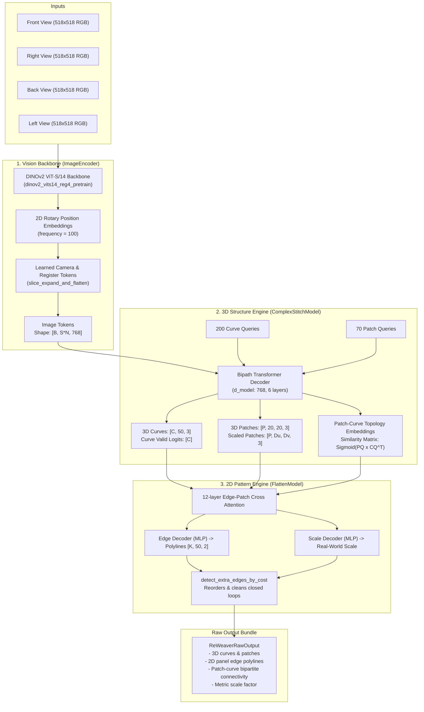

# ReWeaver Deep Integration Guide

**Status**: Verified against upstream code (`vendor/reweaver`, fork of `SII-LiMing/ReWeaver-Code` commit `7d6367f`)  
**Target Runtime**: Hugging Face Spaces (ZeroGPU / CPU fallback) & Local Inference Runner  
**Canonical Intermediate Representation**: `GarmentIR` (`schema_version: 0.1.0`)

---

## 1. Executive Summary & Verification Audit

ReWeaver is a deep-learning garment reconstruction system developed to recover 3D garment surfaces and editable 2D sewing patterns directly from multi-view RGB imagery. 

A rigorous code audit of `SII-LiMing/ReWeaver-Code` reveals key technical findings:

| Component / Property | Status | Verification Reference |
| :--- | :--- | :--- |
| **PyTorch3D Dependency** | **NOT REQUIRED** | `models/matcher_curve.py:9` (commented out). Native PyTorch Chamfer distance `@torch.jit.script def pairwise_shape_chamfer` is used instead. |
| **Native CUDA / C++ Extensions** | **NONE** | Zero `.cu`, `.cpp`, `.c` files. 100% pure Python + PyTorch. |
| **Inference Nature** | **Pure Feed-Forward** | No iterative test-time optimization, marching cubes, or nerf raymarching. Single forward pass in ~1-3s on GPU. |
| **Checkpoint Footprint** | **~1.71 GB total** | Hugging Face repo `SII-LiMing/ReWeaver`: `complex_stitch.pth` (1002 MB), `flatten.pth` (458 MB), `img_encoder.pth` (247 MB), plus DINOv2 ViT-S (~86 MB). |
| **Input Specifications** | **4 Sparse RGB Views** | 518×518 px, [0, 1] range, standardized normalization, rotary positional embeddings. |
| **Output Representation** | **Structured 2D/3D NPZ** | 3D curves, 3D patches, 2D panel edge polylines, patch-curve connectivity, metric scale. |

> [!IMPORTANT]
> **VERIFIED FROM CODE**: ReWeaver contains no custom CUDA compilation steps, no `torch-scatter`, and no active `pytorch3d` imports. It runs out of the box on standard PyTorch 2.4+ environments, making it an ideal candidate for Hugging Face ZeroGPU.

---

## 2. Model Architecture & Pipeline Flow



---

## 3. Preprocessing & Input Specifications

### Input View Requirements
* **Canonical View Count**: 4 orthogonal or semi-orthogonal viewpoints:
  1. `front` (0°)
  2. `right` (90°)
  3. `back` (180°)
  4. `left` (270°)
* **Image Dimensions**: Square aspect ratio, resized to **518 × 518 px** using bilinear interpolation or Lanczos filtering.
* **Color Space**: 8-bit sRGB, converted to float32 normalized in `[0.0, 1.0]`.
* **Standardization Constants**:
  From `configs/eval_gcd.yaml` and `data.py`:
  ```python
  IMG_MEAN = [0.9329, 0.9249, 0.9200]
  IMG_STD  = [0.1885, 0.2093, 0.2226]
  
  # Standard normalization formula:
  normalized_images = (images_0_to_1 - IMG_MEAN) / IMG_STD
  ```
* **Camera Calibration**: No extrinsic or intrinsic camera matrix is required as input. The vision aggregator uses learned camera tokens and relative 2D rotary positional embeddings (`vggtencoder/aggregator.py:347`) to automatically encode viewpoints.

---

## 4. Checkpoint Profiles & Weight Hosting

Official weights are published under Hugging Face repository [`SII-LiMing/ReWeaver`](https://huggingface.co/SII-LiMing/ReWeaver):

| File Path in Repo | File Size | Description |
| :--- | :--- | :--- |
| `GCD_ori/complex_stitch.pth` | **1002.39 MB** | 3D curve & patch transformer, queries, topology projectors |
| `GCD_ori/flatten.pth` | **457.53 MB** | 2D edge decoder, cross-attention layers, scale decoder |
| `GCD_ori/img_encoder.pth` | **246.88 MB** | Multi-view aggregator ViT transformer layers |
| `tileable/*` | **1706.80 MB** | Alternative weights trained on tileable GCD textures |
| `dinov2_vits14_reg4_pretrain.pth` | **85.60 MB** | Meta DINOv2 vision foundation backbone (auto-cached) |

* **Total Runtime Footprint**: ~1.79 GB on disk.
* **VRAM Consumption**:
  * FP32 inference: ~3.8 GB VRAM.
  * FP16/BF16 inference: ~2.1 GB VRAM.
  * Fits comfortably within ZeroGPU allocation (24GB - 48GB).

---

## 5. Output Data Structures (`ReWeaverRawOutput`)

The model serializes its output to `.npz` format (`main.py:658-663`). The fields are structured as follows:

```json
{
  "name": "sample_garment_001",
  "curve_points": [
    // Shape: [num_curves, 50, 3] in canonical [-1, 1] 3D coordinates
  ],
  "curve_valid_prob": [
    // Shape: [num_curves], confidence float between 0.0 and 1.0
  ],
  "patch_points": [
    // Shape: [num_patches, 20, 20, 3], unscaled 3D surface points
  ],
  "patch_points_scaled": [
    // Shape: [num_patches, Du, Dv, 3], metric adaptive-resolution surface mesh
  ],
  "patch_valid_prob": [
    // Shape: [num_patches], patch confidence float
  ],
  "patch_curve_similarity": [
    // Shape: [num_patches, num_curves], continuous affinity matrix [0.0, 1.0]
  ],
  "patch_curve_connectivity": [
    // Shape: [num_patches, num_curves], boolean incidence matrix (th > 0.5)
  ],
  "flatten_pred": {
    "0": {
      "edge_points": [
        // Shape: [num_edges_in_panel, 50, 2], 2D normalized panel boundary points
      ],
      "scale_pred": [1.428] // Metric scale multiplier
    },
    "1": { ... }
  }
}
```

---

## 6. Mathematical Seam Derivation from Bipartite Incidence

A pivotal insight from `vendor/reweaver/models/flatten.py:1195-1230` is how 3D topology connects to 2D sewing patterns:

1. **Panel-Curve Mapping**:
   For panel $p$, its boundary edges correspond directly to the non-zero entries in row $p$ of `patch_curve_connectivity`:
   $$E_p = \{ c \mid \text{patch\_curve\_connectivity}[p, c] = \text{True} \}$$
   The order of edges in $E_p$ matches the edge index $k \in [0, |E_p|-1]$ in `flatten_pred[p]["edge_points"]`.

2. **Seam Identification**:
   For any 3D curve $c$:
   * If $\sum_p \text{patch\_curve\_connectivity}[p, c] = 1$, curve $c$ is a **free boundary** (e.g. hemline, neckline, armhole).
   * If $\sum_p \text{patch\_curve\_connectivity}[p, c] = 2$, curve $c$ connects exactly two panels $p_1$ and $p_2$. This defines a **sewing seam** between edge $k_1$ of panel $p_1$ and edge $k_2$ of panel $p_2$.
   * If $\sum_p \text{patch\_curve\_connectivity}[p, c] > 2$, curve $c$ represents a complex joint (e.g. 3-way seam intersection, yoke seam, or pleat).

3. **Edge Direction Alignment**:
   In 3D, curve $c$ has a fixed direction $c(t), t \in [0, 1]$. In 2D, panel $p_1$ traverses edge $k_1$ in direction $d_1 \in \{+1, -1\}$, while panel $p_2$ traverses edge $k_2$ in direction $d_2$. When $d_1 = d_2$, one edge must be flagged with `reversed: true` in `GarmentIR.seams` to ensure vertices stitch properly during physical cloth simulation.

---

## 7. Mapping Rules: ReWeaver to GarmentIR

To maintain architectural integrity and prevent hallucination, the adapter adheres to strict mapping rules:

| ReWeaver Output | GarmentIR Field | Mapping Logic |
| :--- | :--- | :--- |
| `flatten_pred[p].edge_points * scale` | `GarmentPanel.boundary.edges` | Sampled as `kind: 'polyline'` (or converted to cubic bezier curves if smooth). Units mapped to `mm`. |
| `patch_curve_connectivity` (incidence = 2) | `GarmentSeam` | Generates pairwise seam between `edges_a` and `edges_b`. Confidence set to $\min(\text{prob}_1, \text{prob}_2)$. |
| `patch_curve_connectivity` (incidence = 1) | Free Boundary | Stays unseamed in GarmentIR. |
| `patch_points_scaled[p]` center & normal | `GarmentPanel.placement_3d` | Calculates 3D centroid and normal vector. Binds to nearest avatar cylinder (`Torso`, etc.). |
| Hidden closures (zippers, buttons) | `GarmentIR.hypotheses` | **DO NOT HALLUCINATE**. Marked as `hypotheses` with `closure_type` alternatives and lower confidence. |
| Darts / Internal style lines | `GarmentPanel.internal_features` | Only populated if explicitly detected with high confidence; otherwise empty. |
